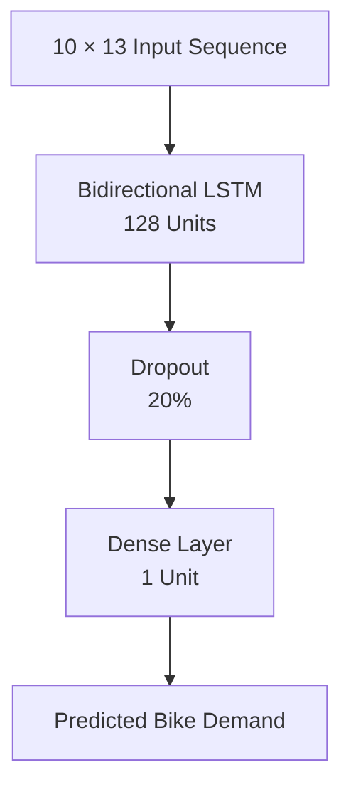
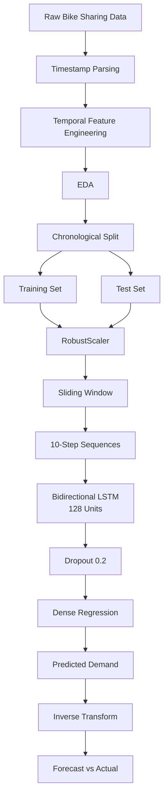

# 🚲 London Bike-Sharing Demand Forecasting

### Multivariate Time-Series Forecasting with Bidirectional LSTM

[](https://www.python.org/)
[](https://www.tensorflow.org/)
[](https://pandas.pydata.org/)
[](https://jupyter.org/)
[](#)

> A deep-learning time-series forecasting project that predicts hourly London bike-sharing demand using historical demand, weather conditions, and temporal/calendar signals.

---

## 📌 Overview

Bike-sharing demand is highly dynamic and influenced by multiple interacting factors such as:

* Time of day
* Day of the week
* Season
* Temperature
* Humidity
* Wind conditions
* Weather conditions
* Holidays and weekends

This project treats bike demand as a **multivariate time series** and uses a **Bidirectional Long Short-Term Memory (BiLSTM)** neural network to learn temporal dependencies from historical observations.

The model receives the previous **10 hourly observations** and predicts bike demand for the subsequent time step.

### Core forecasting pipeline


---

# 🎯 Problem Statement

The objective is to forecast the number of bikes demanded at the next hourly time step based on recent historical observations and contextual variables.

Formally:

**Given**

> X(t-9), X(t-8), ..., X(t)

predict:

> Demand(t+1)

where each observation contains historical demand and environmental/contextual information.

This converts the raw time series into a **supervised sequence-learning problem**.

---

# 📊 Dataset

The project uses the **London Bike Sharing** dataset.

The notebook contains **17,414 hourly observations** across 9 original variables.

### Original variables

| Feature        | Description                  |
| -------------- | ---------------------------- |
| `timestamp`    | Hourly observation timestamp |
| `cnt`          | Total bike-sharing demand    |
| `t1`           | Real temperature             |
| `t2`           | Feels-like temperature       |
| `hum`          | Humidity                     |
| `wind_speed`   | Wind speed                   |
| `weather_code` | Weather condition category   |
| `is_holiday`   | Holiday indicator            |
| `is_weekend`   | Weekend indicator            |
| `season`       | Season category              |

The target variable is:

```text
cnt
```

representing the number of bikes rented during the corresponding hour.

---

# 🔎 Exploratory Data Analysis

The notebook explores demand patterns across several temporal dimensions.

### Temporal analysis

Timestamp information is decomposed into:

* Hour
* Day of month
* Day of week
* Month

These features allow the model to capture recurring temporal patterns.

Monthly aggregation is also performed to inspect longer-term demand patterns.

The analysis further investigates demand across weekdays and seasons, helping expose recurring behavioral patterns in bike usage.

---

# 🧠 Feature Engineering

The timestamp is transformed into explicit temporal signals:

```python
df['hour'] = df.index.hour
df['day_of_month'] = df.index.day
df['day_of_week'] = df.index.dayofweek
df['month'] = df.index.month
```

This gives the forecasting model access to both:

### Temporal features

* Hour of day
* Day of month
* Day of week
* Month

### Environmental features

* Temperature
* Feels-like temperature
* Humidity
* Wind speed

### Contextual features

* Weather condition
* Holiday
* Weekend
* Season

---

# 🧪 Train / Test Strategy

Because this is a time-series problem, the data is split **chronologically** rather than randomly.

```text
90% Historical Data  ───────────────► Training
10% Most Recent Data ───────────────► Testing
```

The dataset contains:

```text
17,414 observations

Training: 15,672
Testing:   1,742
```

The notebook preserves temporal ordering during this split.

Within the training data, 10% is subsequently used for validation while keeping `shuffle=False`, preserving sequence ordering during model training.

---

# ⚙️ Data Scaling

The numerical features are transformed using **RobustScaler**.

```python
f_columns = [
    't1',
    't2',
    'hum',
    'wind_speed'
]
```

Separate scalers are maintained for:

* Input features
* Target demand

Importantly, the scalers are fitted using the **training data** and then applied to both training and test sets.

Robust scaling is useful when working with real-world demand data where extreme observations can distort conventional mean/standard-deviation based scaling.

---

# 🪟 Sliding-Window Sequence Generation

The time series is transformed into overlapping sequences.

The model uses:

```text
time_steps = 10
```

Therefore, every training example contains the previous **10 hourly observations**.

The resulting training tensor has the shape:

```text
(samples, time_steps, features)

(15,662, 10, 13)
```

with one target value per sequence.

Conceptually:

```text
Hour t-9 ─┐
Hour t-8  │
Hour t-7  │
Hour t-6  │
Hour t-5  │
Hour t-4  ├──► BiLSTM ───► Demand at t+1
Hour t-3  │
Hour t-2  │
Hour t-1  │
Hour t   ─┘
```

This formulation allows the neural network to learn relationships across consecutive observations instead of treating each row as an independent sample.

---

# 🧠 Model Architecture

The forecasting model is implemented using TensorFlow/Keras.



### Architecture

| Layer     | Configuration               |
| --------- | --------------------------- |
| Input     | 10 time steps × 13 features |
| BiLSTM    | 128 units                   |
| Dropout   | 20%                         |
| Output    | Dense, 1 neuron             |
| Loss      | Mean Squared Error          |
| Optimizer | Adam                        |

The original implementation uses a 128-unit Bidirectional LSTM followed by 20% dropout and a single regression output.

---

# 🔥 Why LSTM?

Traditional feed-forward models treat observations independently unless temporal dependencies are explicitly engineered.

LSTMs are designed for sequential data and maintain internal representations of information across time.

For bike demand forecasting, this is useful because demand can exhibit:

* Short-term temporal dependence
* Recurring daily patterns
* Weather-related changes
* Weekly behavioral patterns
* Seasonal effects

The project therefore frames demand prediction as a **sequence-learning problem rather than a conventional tabular regression problem**.

---

# 🔄 Training Configuration

The model is trained using:

```python
epochs = 30
batch_size = 32
validation_split = 0.1
shuffle = False
```

The notebook records:

```text
Training samples:   14,095
Validation samples: 1,567
```

Training is intentionally performed without shuffling so that the temporal structure of the sequence data is retained.

The recorded validation loss reaches approximately **0.0286** at its lowest point during the 30 training epochs, with the final epoch reporting approximately **0.0295** validation loss. These are losses on the scaled target, not bike-count units.

> **Important:** the notebook does not report a final inverse-transformed MAE/RMSE/MAPE metric. Therefore, this README intentionally does not claim an "X% prediction accuracy."

---

# 📈 Forecast Generation

After training, predictions are generated for the held-out test sequences.

The predicted values are then transformed back into the original bike-count scale using the inverse transformation of the target scaler.

The notebook visualizes:

* Historical demand
* Actual test demand
* Predicted test demand

allowing the forecast trajectory to be compared against observed demand.

---

# 🏗️ End-to-End Architecture



---

# 🛠️ Technology Stack

### Programming & Analysis

* Python
* NumPy
* Pandas
* Matplotlib
* Seaborn

### Machine Learning

* TensorFlow
* Keras
* Scikit-learn

### Modeling

* Bidirectional LSTM
* Sequence learning
* Sliding-window forecasting
* Multivariate time-series regression

### Environment

* Jupyter Notebook
* Google Colab compatible workflow

---

# 📂 Project Structure

```text
Time-Series-Analysis/
│
├── demand_prediction.ipynb
└── README.md
```

The primary artifact is the Jupyter notebook containing the complete exploratory analysis, preprocessing pipeline, sequence construction, model training and forecasting workflow.

---

# 🚀 Running the Project

### 1. Clone the repository

```bash
git clone https://github.com/singh-rounak/Time-Series-Analysis.git

cd Time-Series-Analysis
```

### 2. Install dependencies

```bash
pip install numpy pandas matplotlib seaborn scikit-learn tensorflow gdown jupyter
```

### 3. Launch Jupyter

```bash
jupyter notebook
```

Open:

```text
demand_prediction.ipynb
```

Alternatively, the notebook can be executed in Google Colab.

---

# 🧩 Key Technical Concepts Demonstrated

This project demonstrates several foundational concepts that remain relevant to production forecasting systems:

* Multivariate time-series analysis
* Temporal feature engineering
* Chronological train/test splitting
* Data leakage awareness
* Robust feature scaling
* Sliding-window sequence generation
* Sequence-to-one forecasting
* LSTM-based deep learning
* Validation without temporal shuffling
* Inverse transformation of predictions
* Actual-vs-predicted visualization

---

# ⚠️ Limitations & What I Would Improve Today

This project was originally developed as a learning/research project, so there are several areas I would improve in a production-grade implementation.

### 1. Stronger forecasting evaluation

The original notebook does not calculate explicit business-facing metrics such as:

* MAE
* RMSE
* MAPE / sMAPE
* WAPE

I would add these on the **inverse-transformed test predictions**.

### 2. Rolling-origin backtesting

A single holdout period is useful, but production forecasting should ideally use:

```text
Train → Validate → Forecast
Train + New Data → Validate → Forecast
Train + More Data → Validate → Forecast
```

This provides a more robust estimate of performance across different periods.

### 3. Baseline models

A neural network should not be evaluated in isolation.

I would establish baselines such as:

* Naïve forecast
* Seasonal naïve
* Moving average
* ARIMA/SARIMA
* Gradient-boosted trees with lag features

Then compare the BiLSTM against them.

### 4. Causal forecasting architecture

The original implementation uses a **Bidirectional LSTM**. While the network only receives historical input windows and does not directly consume future target values, a production forecasting system would generally favor a **causal/unidirectional architecture** because it more directly reflects the direction of information flow at inference time.

### 5. Hyperparameter optimization

Potential tuning dimensions include:

* Lookback window
* LSTM depth
* Hidden units
* Dropout
* Learning rate
* Batch size
* Forecast horizon

### 6. Modern productionization

A production version could add:

```text
Data Ingestion
      ↓
Feature Pipeline
      ↓
Feature Store / Data Lake
      ↓
Forecasting Model
      ↓
Model Registry
      ↓
Batch / API Inference
      ↓
Monitoring & Drift Detection
```

This would transform the notebook from a modeling exercise into an end-to-end forecasting system.

---

# 💡 Business Applications

The same forecasting architecture can be applied to:

* Bike-sharing demand planning
* Fleet allocation
* Inventory forecasting
* Retail demand prediction
* Ride-hailing demand
* Energy consumption forecasting
* Logistics volume forecasting
* Workforce planning

The underlying pattern is the same:

> **Historical demand + contextual signals → temporal model → future demand estimate**

---

# 🎓 What This Project Demonstrates

Rather than simply applying a neural network to a dataset, this project demonstrates the complete transformation:

```text
Raw Time Series
      ↓
Understand Temporal Structure
      ↓
Engineer Temporal + Contextual Features
      ↓
Chronological Data Split
      ↓
Scale Numerical Variables
      ↓
Create Sequential Training Windows
      ↓
Train Sequence Model
      ↓
Generate Future Predictions
      ↓
Transform Back to Business Units
      ↓
Compare Forecast vs Actual
```

---

## 👨‍💻 Author

**Rounak Singh**

Data Engineering • Machine Learning • Time-Series Forecasting • AI

[GitHub](https://github.com/singh-rounak)

---

## ⭐ Project

If you find the project useful, consider starring the repository.

**Repository:**
https://github.com/singh-rounak/Time-Series-Analysis
